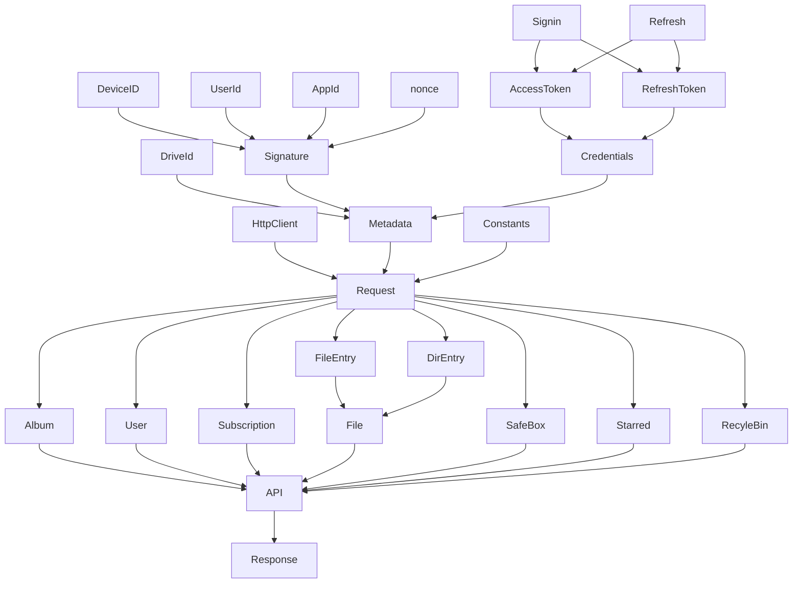

# Rust implementation of Aliyundrive API

I am a Rust beginner, and this is my first project in Rust development, which is not yet available. Its progress is slow, and my learning progress is also slow, but it will be continuously updated.

## Overview Diagram

I have actually done some development-related work. I want to do some small refactoring at this stage, but I can't see the whole picture of this project completely yet. However, I am trying to explain what this project may accomplish with the following diagram.

